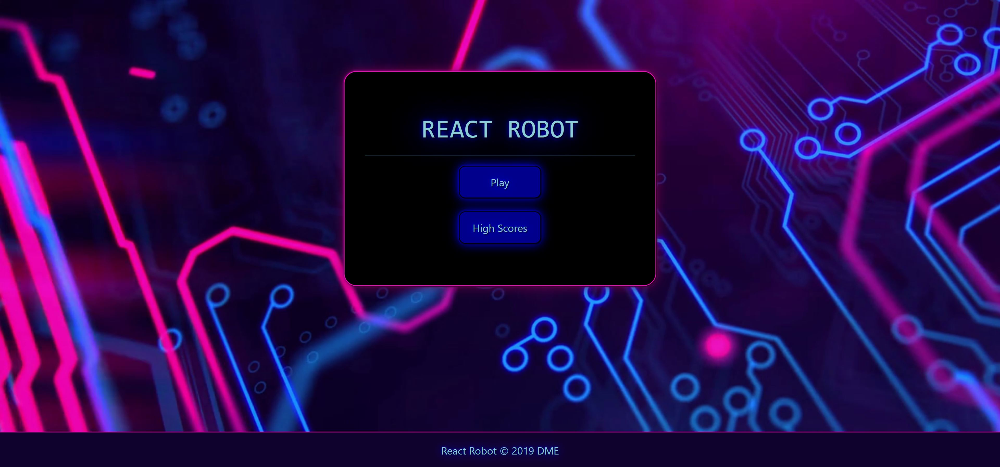
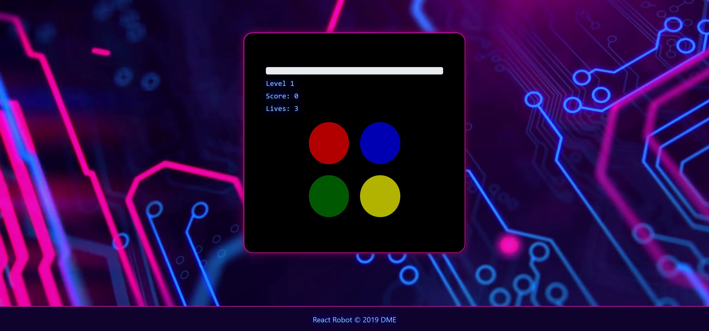
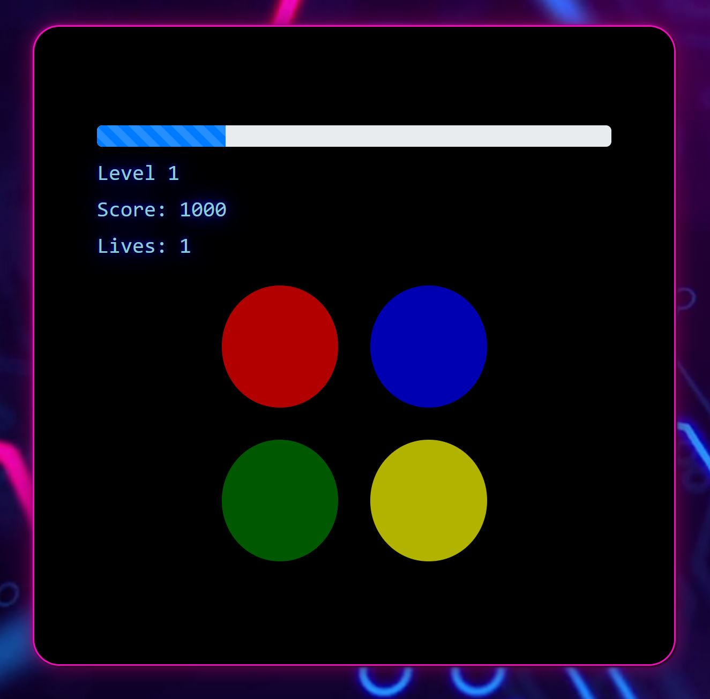
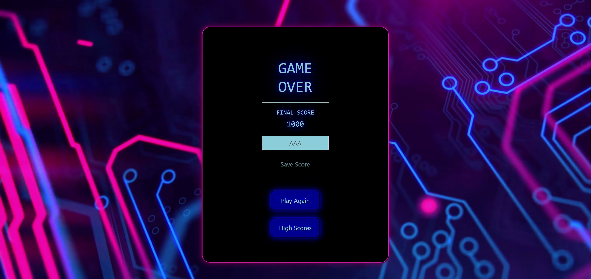

# React Robot 2.0
React Robot is a high-score memory game in which the user must 'react' and respond with the correct pattern the computer presents them on the screen.

This is a full stack web application that allows users to save their highest score to a SQL database and battle for the number one spot.

## Technologies Used
HTML
CSS
React.js
Express
Bootstrap
Node.js
SQL

## Using the App

- Play will immediately launch the game.
- High Scores will take you directly to the Leader Board to check the latest high scorers

### Game Screen

- the buttons will light up in order from a randomized array generated each turn
- the pattern starts off at 3 and gets longer every 4 correct turns
- users have 3 lives before their score can be recorded
- points are curved and based off your current level
- there is no limit to the level

### Progress Bar

### Game Over

### Leader Board

